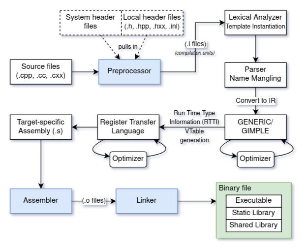

# C++

// templates (Boost.Hana and std library?)

// define programming paradigms in tags

The C++ programming language features ahead of time (AOT) compilation, and supports procedural (imperative) programming (like C), as well as functional, object-oriented, and generic programming. 

Its type system is static, partially inferred (vs. fully† manifest in C), and nominal.

Function parameters are passed by value (copied), except for arrays, which are passed as pointers.

C++ has been standardized since 1998. Its development began in 1979 at Bell Labs by Bjarne Stroustroup as "C with classes", and was based on C in its early days. The content in this folder will reflect C++ from the first standard (C++98) up through the features included in the 2026 standard, C++26.

Implementation-defined, undefined, and unspecified behavior are as alive in C++ as they are in C. The [README for C](../C/README_C.md) provides a lot of background information for understanding C++.

† C ressurrected the `auto` keyword for type inference in the C23 standard.

> ⚠️ **Note**  
> C++ is **not** a superset of C!

C++ aims to interoperate cleanly with C at the application binary interface (ABI) level, not just the source level. This means that:
* C++ can link to C functions and libraries
* Most C libraries can be used in C++ without modification
* Name mangling (more on that later) can be disabled by wrapping code in `extern "C" { ... }` to match C linkage expectations.

**Consequences of C compatibility:**
* Most of the C standard library is incorporated in the C++ standard
* Features that break C compatibility are typically avoided or carefully introduced
* There are joint standardization efforts to keep common language features, such as atomics, consistent between the two languages (i.e., there is some C++ influence on the more recent C standards)

**Incompatibilities with C:**
* Additional keywords reserved in C++: `new`, `class`, `template`, and many more
* Implicit conversion differences: `void*` doesn't implicitly convert to/from other pointer types
* Structs have enhanced capabilities in C++ (they can have constructors and methods just like a class)
* C99/C11 features are not fully supported in C++ (such as VLAs)

**Design Goals of C++:**
* Try not to invalidate C code unless absolutely required by a new feature
* Zero-cost abstractions whenever possible: write high-level code with no runtime penalty, just like C.

// Examples of C++ not being a superset of C?

---
---

[!TOC]

---
---

## Creating a Binary

As with C, there are 3 main programs involved in creating a binary, such as an executable, from C++ source code.

They are:  
* the preprocessor,
* the compiler, and
* the linker.

When we build a C++ program, all three of these steps occur sequentially by default.

Any references to compiler flags here are referring to the GNU C++ compiler `g++`.

The high-level steps of the compilation process are very similar to the C programming language, however, much of the parsing is context sensitive due to function and operator overloading, templates, name lookup (depending on scope, inheritance, and template instantiation context), as well as constructs that are ambiguous without semantic information. The complexity of the front-end for C++ compilation is much greater than that for C compilation.

C++ introduces the concept of [**namespaces**](https://en.cppreference.com/w/cpp/language/namespace), a way to scope named entities, reducing the chances for name collision in large projects. Anything not in a `namespace` is part of the global namespace, accessible with the scope resolution operator `::`.

For compatibility with C, where all symbols are under a flat global namespace, C++ **mangles** all namespaced symbols with information including type signatures, scopes, and namespaces to ensure unique names. During compilation, a function `void foo(int, std::string)` will be transformed into something like `_Z3fooiNSt7__cxx1112basic_stringIcSt11char_traitsIcESaIcEEE`.

C++ retains the preprocessor capabilities present in C.

In addition, C++ sometimes generates some code at compile time, most notably via templates (the mechanism for generic programming), which might require the compiler to track usage across translation unit boundaries. Since templates can't be precompiled (outside of special support, e.g. in modules introduced in C++20), many third-party libraries available for C++ are header-only.

Any references to compiler flags here are referring to the GNU C compiler `gcc`.

// Update organization below as it relates to C++, try to keep similar to C

## Objects

The C notion of objects as regions of storage remains alive in C++, but havs been dramatically extended.

- automatic lifetime management (RAII)
- object lifetimes tied to constructors/destructors
- polymorphic objects
- distinction between trivial and non-trivial objects

## Expressions

C++ supports all C expression forms, but also adds additional expressions:

- function overlaoding
- operator overloading
- implicit convertions via constructors and conversion operators
- lambda expressions
- decltype, typeid (template stuff? put into its own section?)
- new casting mechanisms (static_cast, dynamic_cast)
- explicit this pointer usage and expression categories extended thru move semantics
- detail additions especially from c++11 onward

### Types

C++ supports all of the types that C does, but expands on them.

- user-defined types (Classes, structs with member functions, templates)
- references (T&, T&&)
- consexpr types, incomplete types with templating
- enumerations (enum class)
- function types with cv/ref qualifiers (elaborate)
- type deduction mechanisms (auto, decltype, template argument deducation)
- qualifiers on member functions (const, noexcept, &, &&)

### Values

C++ preserves lvalues and rvalues from C, but expands them into additional types, which are essential in move semantics, overload resolution, and lifetime extension rules:

- lvalue
- xvalue
- prvalue
- glvalue
- rvalue

In addition, C++ distinguishes between value categories (expression-related) and value kinds (object vs. function vs. reference)

## Storage-Class Specifiers

C's storage classe are retained but recontextualized:

- register
- auto
- thread_local, mutable (for member variables)
- storage duration interats with object lifetime via constructors/destructors

## Type Qualifiers

C++ inherits const and volatile, but adds:

- mutable
- constexpr/consteval
- noexcept
- restrict (not in C++ but in C99)

## Operator Precedence & Associativity

C's operator precedence and associativity apply, with additional operators:

- scope resolution (`::`)
- member pointer dereference (`.*`, `->*`)
- `new` and `delete` operators

Operators may be overloaded.

## Memory Layout

C's memory layout applies, but C++ adds additional complexity:

- object layout is influenced by inheritance, vtables, and alignment
- elaborate on standard layout types vs. POD vs. trivial types
- padding, base class subobjects, layout compatibility rules apply (details)

## Memory Management

C++ provides several tools for memory management beyond C, especially since C++11:

- `new` and `delete`
- placement new (deets)
- automatic lifetimes (RAII via constructors/destructors)
- smart pointers (unique_ptr, shared_ptr)
- std::allocator and custom allocators
- memory resources tied to <memory_resource> in newer standards (details??)
- 

## VS Code Setup

### Windows

### Linux

## Build Systems

## External Libraries

## Using the Debugger