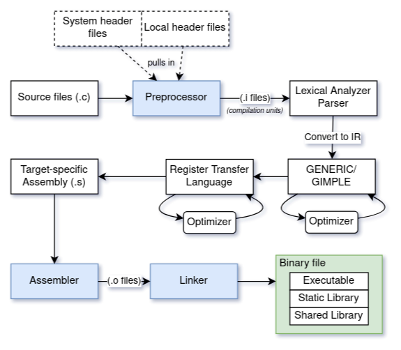

# C

The C programming language features ahead of time (AOT) compilation, and supports imperative and procedural programming. It is statically typed, with weak type safety and no memory safety.

Function parameters are passed by value (copied), except for arrays, which are passed as pointers.

## Creating a binary

There are 3 main programs involved in creating a binary, such as an executable, from C source code. They are the preprocessor, the compiler, and the linker. When we build a C program, all three of these steps occur sequentially by default.

Any references to compiler flags here are referring to the GNU C compiler `gcc`.



### Preprocessor
---

The [C preprocessor](https://gcc.gnu.org/onlinedocs/gcc-2.95.3/cpp_1.html) is a fancy text replacement machine. The preprocessor is what replaces all of your `// single line comments` and `/* multi-line comments */` with whitespace.

Lines that start with `#` invoke preprocessing directives. The most common uses are to make the contents of header files available in a source file, conditional compilation, and macros. Directives may be cosmetically split into multiple lines by ending a line with `\\n`. The preprocessor removes these to put everything on one line.

The (normally temporary) files output by the preprocessor usually have the `.i` extension and are known as **translation units** or **compilation units**.

#### #include

There are a number of header (`.h`) files provided by your operating system containing functions for basic tasks, such as opening files or printing to the screen. Header files contain **declarations** of functions.

When used to make header files available, the `#include` preprocessing directive is more or less equivalent to copying that file's contents into a copy of the current file, once complete.

`#include <file>` starts the search for files in the directories specified by the `-I` flag in your call to gcc, then in the standard OS directories, while `#include "file.h"` starts the search in the current directory, then in the standard OS directories.

#### Conditional Compilation

The most common usage of conditional compilation is with header guards.

In C (and C++), multiple `#include` directives for the same file will include it over and over again; besides wasting time, if a function or a type is defined more than once, a compilation error will occur, because there is ambiguity about which copy of a function, type, etc. to call. With a header guard, we create a parameterless macro that prevents the header file from being included more than once.

```C
#ifndef MyHeader_H
#define MyHeader_H

// header file contents

#endif /* MyHeader_H */
```

The header guard is a big `if` statement; if we haven't included this file before (`MyHeader_H` is not defined), we will include it, otherwise do nothing. Most C preprocessors will also support the directive `#pragma`. If yours does, you can simply put `#pragma once` before your header file's code. This will act identically to the header guard in most cases.

Another common usage is for functions that are defined in different headers on different operating systems: 

```C
#ifdef _WIN32
#include <windows.h>
#endif

#if defined(__linux__) || defined(__unix__)
#include <unistd.h>
#endif
```

A reference for predefined compiler macros can be found [here](https://github.com/cpredef/predef). `__MSC_VER` is commonly used in projects that may be compiled with Visual Studio's compiler, `cl`.

Conditional compilation is commonly used to provoke different behavior only if doing a Debug build, relative to a Release (optimized) build:

```C
int sum(int a, int b) {
    int total = a + b;

#ifdef _DEBUG
    printf("Debug: a = %d, b = %d, a + b = %d\n", a, b, sum);
#endif

    return total;
}
```

C Comments do not nest, if you need to keep commented out code for reference you can simply wrap it in `#if 0 ... #endif`

#### Macros

Macros are convenient abbreviations capable of black magic. Header guards are an example of a macro with no parameters, but they may have parameters. By convention, their names are in all caps. The preprocessor replacing the macro name with its definition is known as macro expansion. Note that macro expansion happens after comments are replaced with whitespace.

They are sometimes used to define constants, and after expansion and usage, they are checked for references to other macros. 

```C
#define BUFFER_SIZE 100
#define N_ELEMENTS BUFFER_SIZE
#define min(X, Y)  ((X) < (Y) ? (X) : (Y))
#undef N_ELEMENTS
```

It is best practice to put parentheses around each argument to a macro to prevent unintended behavior.

```C
#define ceil_div(x, y) (x + y - 1) / y
// expands to:   (x & y + sizeof (int) - 1) / sizeof (int);
// precedence:   (x & (y + sizeof (int) - 1)) / sizeof (int);
// but we want:  ((x & y) + sizeof (int) - 1)) / sizeof (int);
#define ceil_div(x, y) (((x) + (y) - 1) / (y))
/* correct behavior; wrapping in parentheses prevents unintended behavior
when doing something with the result of the macro, e.g. sizeof(ceil(x, y)) */
```

Refer to the GNU page on the C preprocessor for more preprocessor directives.

### Compilation & Assembly
---

The `.i` files (compilation units) produced by the preprocessor are used as input to the compiler. This effectively means each `.c` file becomes an independent compilation unit.

All functions used in a compilation unit must be **declared** (as is typically done in `.h` files). 

The compiler first checks that the source code follows the syntax, semantics, and grammar of C (lexical analysis, parsing). Next, the source code is converted into an intermediate representation (**IR**). For gcc, this IR is called GENERIC.

GENERIC is a language-independent way of representing a function as a tree. From here, the GENERIC expressions are broken down into tuples with (mostly) up to 3 operands; this IR is called GIMPLE. For C/C++, the compiler converts directly to GIMPLE with no GENERIC intermediary. The GIMPLE is then used as input to the optimizer.

The optimizer's goal is to improve code's performance and size. As a consequence of this, compile times increase. There are several optimizer (`-O{#}`) flags that can be passed in, which are themselves (mostly) shorthand for a number of optimizer flags. `-O0` is the default and makes debugging behave as expected. The `-g` argument will generate debug info. The optimizer outputs optimized GIMPLE.

The optimized GIMPLE is converted into another IR called register transfer language (RTL), a lower-level representation that (mostly) generically describes how the hardware register operations occur. Another optimization is done on the RTL, which is generally platform specific and has a tighter scope than the previous higher level optimizations.

Then, assembly code for each compilation unit is generated from the RTL, taking into account target-specific properties such as the number and types of registers. The resulting `.s` files are used as input into the assembler `as`, which produces object files (`.o`) containing machine code for each compilation unit. Object files may contain local symbols, which are used internally to ease relocation by the linker, undefined external symbols (references to other modules where those symbols are defined), and defined external symbols, which allow the object file to be called by other modules.

### Linker
---

The last step in the process is to combine our object files together with the linker `ld`. There are two types of linkage for functions, internal and external. Only those with external linkage (the default) are visible to the linker; static functions have internal linkage and are only visible inside the compilation unit they're defined in. The output of the linker is a binary file that may be an executable (`.exe`), a static library (`.lib`, `.a`), or a shared library (`.dll`, `.so`).

The linker's first job is symbol resolution. Each symbol (i.e. function, variable) that is used needs to have its **definition** found exactly once in one of the object files. Once found, each reference is replaced with the definition.

Some symbols that are used may be defined in existing library files. If they are static libraries, the referenced symbols are copied directly into the output binary. Resolution of some symbols may be deferred until runtime (dynamic linking); in this case, the binary will contain undefined symbols, plus a list of libraries that contain definitions for these symbols.

The final addresses of the blocks (code, data) in object files are not known at generation time, so they usually assume an address base of 0. The linker relocates and adjusts these addresses to avoid overlaps.


