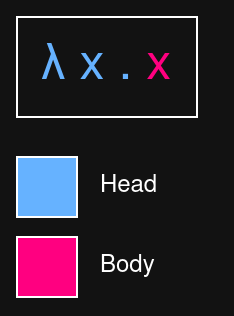

Programs are a combination of **expressions**
Expressions are:
- concrete values
- variables
- functions

**Function**: expressions applied to an argument or input and (once applied) can be reduced or evaluated

**Lambda calculus**
3 basic components (lambda terms):
- expressions (are a superset: can be a variable, an abstraction, or combination)
- variables - lambda term with a head (a lambda) and a body and is applied to an argument (an input value)
- abstractions (functions) - 2 parts: head and body. head is a lambda followed by a variable name. Body is another expression
λx.x
(it is an anonymous function, it can't be called by name)

Application == the act of applying a lambda function to an argument

"alpha equivalence" is a way of saying e.g. these functions, while having different variable names, are identical:
λx.x
λz.z
λa.a
-> does not apply to free variables

"beta reduction" is what happens when you substitute the input expression for all instances of bound variables (i.e. parameters) - this is applying the lambda term to the argument, eliminating the head - this tells you the function has been applied

Syntax:
|x := z| --> all instances of x will be substituted with z.

Applications are left associative unless parentheses suggest otherwise
(λx.x)(λy.y)z is equivalent to:
( (λx.x)(λy.y) ) z

Functions can have multiple heads
Free variables - variables in the body not bound by the head, e.g.
λx.xy <- y is a free variable (x is a bound variable)

Each lambda can only bind 1 parameter and only accept 1 argument
-> function requires multiple arguments ? it has multiple, nested heads. substitute (eliminate) headers left to right.
* that := currying - a function that takes multiple arguments - break it down into a series of functions taking only one argument

"beta normal form" - you can't beta reduce (apply lambdas to args) anymore -> this is a fully evaluated expression, or a fully executed program

combinator - lambda term with no free variables - they combine the arguments they are given
e.g. a function where every term in the body occurs in the head:
λx.x
λxy.x
λxyz.xz(yz)

Some reducible lambda terms don't reduce to a normal form (not because they're fully reduced) - because they diverge
- divergence - the reduction process never terminates/ends

reducing terms normally converges to beta normal form (divergence is the opposite)
e.g.
(λx.xx)(λx.xx)
Let x:=λx.xx
then: (λx.xx)(λx.xx)
-> back to where we started

